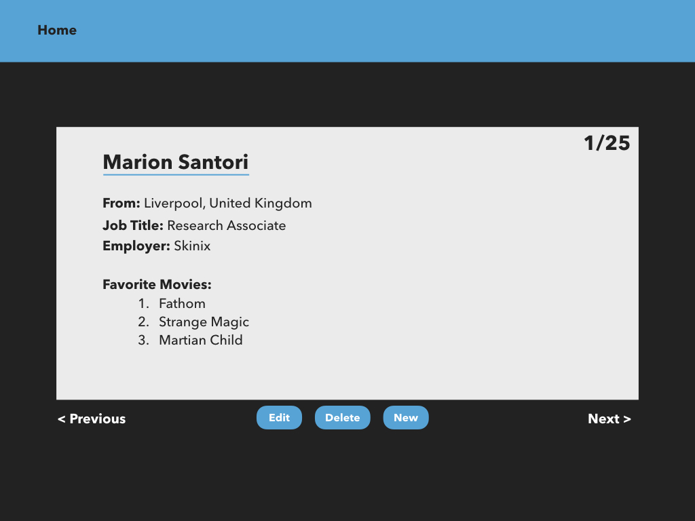

<h1 align="center">Welcome to the React User Directory Project 👋</h1>

  
  

## Screenshot

## Project Goal

Create a user directory that matches a provided mockup. The project was built from the ground up, including CSS and React components. The directory showcases user data in the form of cards that displays their name, where they are from, where they are employed, and their favorite movies.

## Reason for choosing this project:

This was a hands-on React project provided by the [Bright Paths Program](https://www.perficient.com/who-we-are/perficient-bright-paths-program) to help it's coding bootcamp students get familiar with class components in React.

## Technologies:

- React

## Functionality:

- The user can scroll through and view individual person cards by either clicking the "pervious" and "next" buttons.

## Author

👤 **Michael Payne**

- Website: (https://michaelspayneii.com)
- Github: [@MSPayneII](https://github.com/MSPayneII)
- LinkedIn: [@michaelspayneii](https://linkedin.com/in/michaelspayneii)
